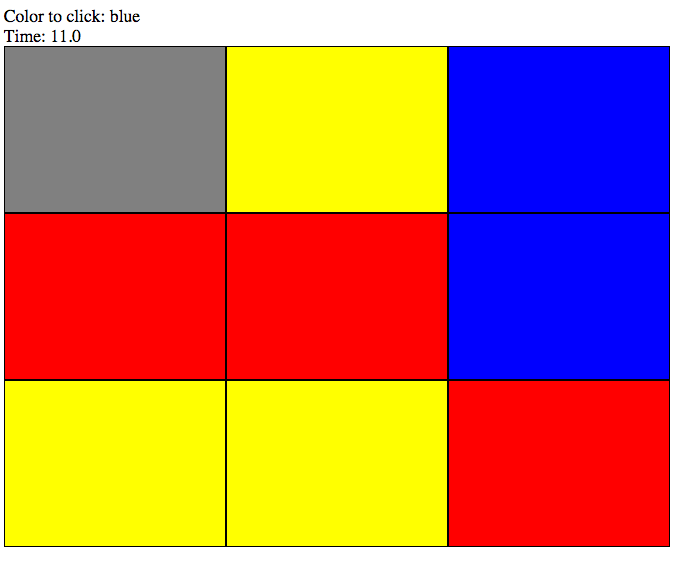

## The Click game

In this exercise you should write a simple click game. The game have nine bricks. At the start of every game round these bricks should have a random color (yellow, blue or red). The game should always have three yellow, three blue and three red. At the start the game should also show a random color that the user is supposed to click. For example if red is the random color the player should click on all red bricks.

The file client/index.html includes a number of div-tags that is positioned out in a simple game board with nine bricks. Maybe you can do this better but that is not the main point for this exercise. From the beginning all these bricks are grey and the idea is that you will write Javascript code that do this:

* Create the game board with three random places bricks in the three different colors at the start of each game round.
* Randomise the “click color” and present that for the player at the start of each game round.
* When the game round starts a timer should be starting and be present for the player.
* When the player clicks a brick with the right color the brick should change color to grey.
* When the player have clicked all the right three bricks the timer should stop and the end time will show.

In the image below the game round have started and the timer is updating on the page. In the top right corner
the player sees the chosen color. The brick in the top left time was a blue brick that the player has clicked.

Of course you can implement more features if you want. For example give the player more time if she/he clicked the wrong brick.

