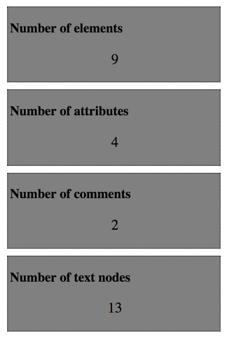

## Temple of DOM

In this exercise you are supposed to parse a DOM-tree (from the file client/index.html) and present the number of elements, attributes, comments and text nodes in the document.

The resultat should be presented for each and every part in the template. The presentation should have a header (h2) and also the number of enteties found (inside p-element)

### Tip
* Using recursion is a good way of solving this exercise
* [https://developer.mozilla.org/en-US/docs/Web/API/Node/nodeType](https://developer.mozilla.org/en-US/docs/Web/API/Node/nodeType)
* Test your page in the incognito mode in the browser because some browser plugins can add elements to the page.
* How many elements will the template-element count as?
* [https://developer.mozilla.org/en-US/docs/Web/HTML/Element/template](https://developer.mozilla.org/en-US/docs/Web/HTML/Element/template)

Look at the picture below for an example of the result.
OBS! This image was captured with plugins activated so your result could vary. 

